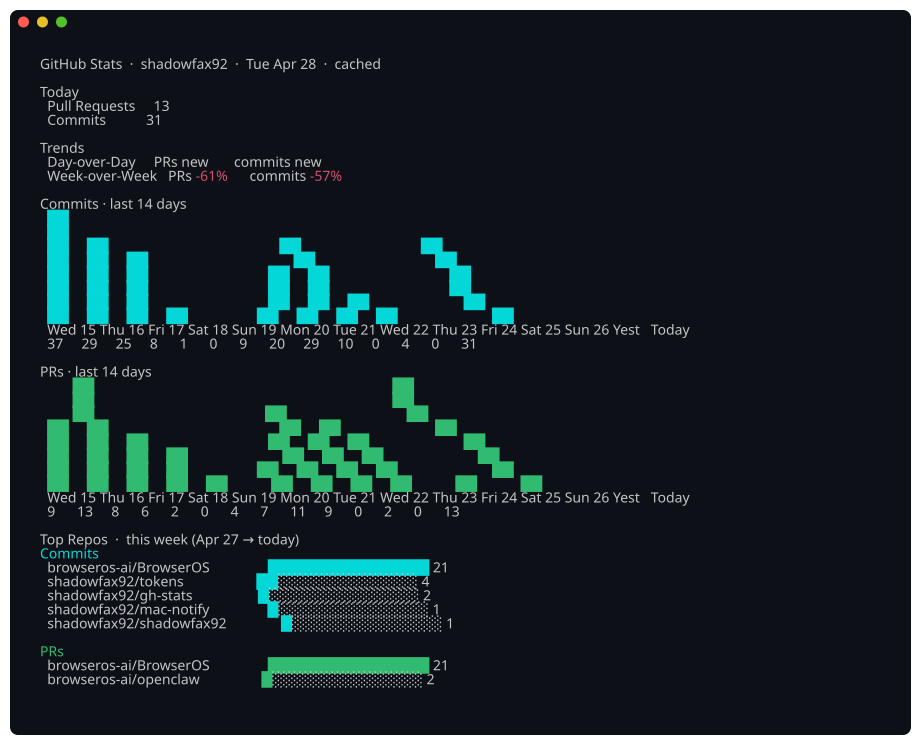
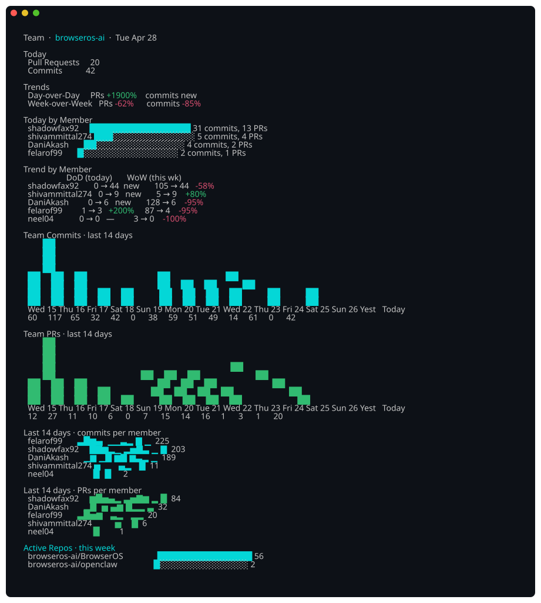
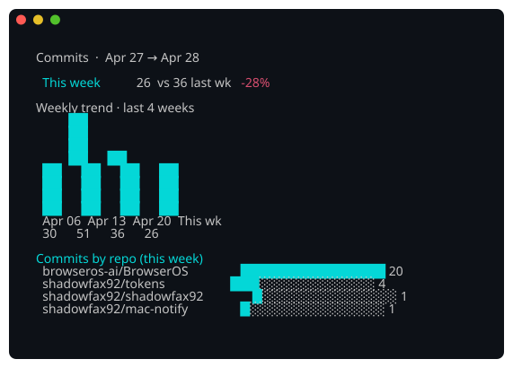
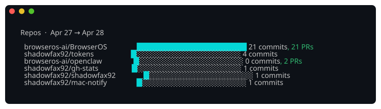

<div align="center">

# 📊 gh-stats

**Daily GitHub contribution stats in your terminal.**

*Today, day-over-day, week-over-week — for you and your whole team.*

</div>

You want to know "how many PRs did I land today?" and "what's my team doing this week?" without leaving the terminal. `gh-stats` pulls your contribution data from the GitHub GraphQL API, caches it, and renders a daily dashboard with sparklines, growth percentages, and per-member breakdowns.

- 📅 **Today first** — top-of-screen answer to "what did I/we ship today?"
- 📈 **Growth %** — explicit day-over-day and week-over-week deltas, color-coded
- 📊 **Daily bar charts** — 14 days of commits and PRs with per-day labels and values
- 👥 **Team breakdown** — per-member sparklines and DoD/WoW trends
- ⚡ **Cached by default** — repeat runs are ~50ms instead of 5s
- 🔧 **JSON output** — pipe data to `jq` or other tools with `--json`

> Looking for AI token usage stats? See [`tokens`](https://github.com/shadowfax92/tokens) — Claude Code + Codex daily spend in the same dashboard format.

---

<div align="center">



</div>

## Install

Requires [Go 1.25+](https://go.dev/dl/) and [GitHub CLI (`gh`)](https://cli.github.com/) authenticated via `gh auth login`.

```sh
git clone https://github.com/shadowfax92/gh-stats.git
cd gh-stats
make install
```

No separate token configuration needed — `gh-stats` uses your `gh` auth token automatically.

## Quick Start

```sh
gh-stats                       # how am I doing today + last 14 days
gh-stats team <org>            # how is my team doing today + per-member breakdown
gh-stats team <org> --prs      # raw merged PRs for org members
gh-stats team <org> --commits  # raw commits for org members
gh-stats commits               # daily commit chart with DoD / WoW
gh-stats --days 30             # extend the trend window to 30 days
```

## Commands

| Command | Description |
|---------|-------------|
| `gh-stats` | Default dashboard — today, trends, 14-day sparklines, top repos |
| `gh-stats commits` | Daily commits — today, DoD, WoW, daily bar chart, repos |
| `gh-stats prs` | Daily PRs — same shape as commits |
| `gh-stats repos` | Repos ranked by combined commits + PRs (this week) |
| `gh-stats orgs` | List your GitHub organizations |
| `gh-stats team <org>` | Team-wide stats — today, DoD/WoW, per-member breakdown + sparklines |
| `gh-stats team <org> --member <user>` | Filter team view to one member |
| `gh-stats team <org> --prs` | Merged PR rows for org members, grouped by day |
| `gh-stats team <org> --commits` | Commit rows for org members, grouped by day |
| `gh-stats refresh` | Bust the cache and re-fetch |
| `gh-stats cache` | Print cache path; `--clear` to delete it |

### Global flags

| Flag | Default | Description |
|------|---------|-------------|
| `--days N` | `14` | Window in days for trends and charts |
| `--no-cache` | `false` | Bypass cache, force re-fetch |
| `--json` | `false` | JSON output |
| `--user <login>` | auto-detected | GitHub username |

`team --prs` and `team --commits` support `--json` for automation. The JSON shape is day-grouped:

```sh
gh-stats team browseros-ai --prs --days 7 --json
gh-stats team browseros-ai --commits --days 7 --json
```

## Team dashboard

`gh-stats team <org>` is the killer view — today's totals, per-member breakdown, day-over-day and week-over-week trends per person, plus a 14-day sparkline row for each member:

<div align="center">



</div>

## engprod-daily skill

This repo includes `skills/engprod-daily/`, a local report skill that uses `gh-stats` as its raw GitHub activity source. It expects a small config with a GitHub org and engineers:

```yaml
name: browseros
org: browseros-ai
engineers:
  - DaniAkash
  - felarof99
```

The skill writes local HTML/JSON reports under `reports/<name>/<date>/` and does not publish or post to Slack.

## Per-area deep dives

`gh-stats commits` and `gh-stats prs` zoom in on one metric with a daily bar chart over the `--days` window:

<div align="center">



</div>

`gh-stats repos` ranks repos by combined commits + PRs:

<div align="center">



</div>

## Config

Location: `~/.config/gh-stats/config.yaml` (or `$XDG_CONFIG_HOME/gh-stats/config.yaml`)

Your GitHub username is auto-detected from `gh` on first run and cached here. You can also set it manually:

```yaml
username: shadowfax92
```

The fetch cache lives at `~/.cache/gh-stats/cache.json`. Print or clear it with:

```sh
gh-stats cache         # print cache path
gh-stats cache --clear # delete the cache
gh-stats refresh       # re-fetch this/last week
```

## Shell completions

```sh
make completions    # installs fish completions
```

---

<div align="center">

> Personal tool I built for my own workflow. Feel free to fork and adapt.

</div>
